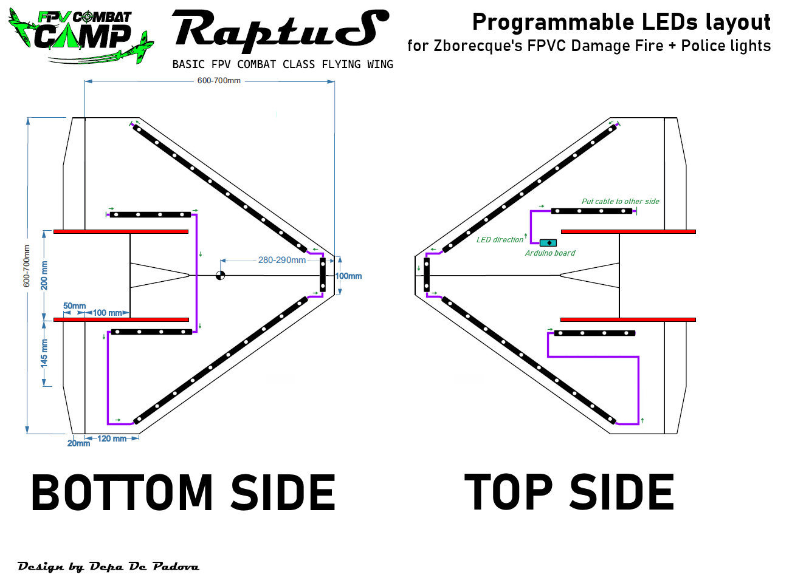
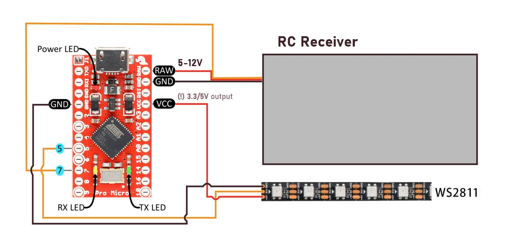

# Zborecque's Arduino LED projects

Just a bunch of my personal Arduino experiments used mainly to operate addressable LED stripes on my RC models fleet.

## Setup
* Board: `SparkFun Pro Micro` 5V ([more details](https://learn.sparkfun.com/tutorials/pro-micro--fio-v3-hookup-guide/all)).
* WS2811 LED tape of 60 programmable LEDs.
* **NOTE!** remember to select the right CPU voltage (in my case it's 5V - which is better for RC appliances, as many RC receivers are using 5V output, and it's also used by many programmable LED strips) in Arduino SDK. In case you mess up and upload script for 3.3V [look here](https://learn.sparkfun.com/tutorials/pro-micro--fio-v3-hookup-guide/troubleshooting-and-faq#ts-reset). If you insist on using 3.3V board - please carefully check the board documentation to confirm that it can still be powered with higher voltage, and remember about the voltage needed by the LED strip itself.

## Projects

### FPV_Combat_damage_fire

A concept of having a [FPV Combat](https://fpv-combat.com) aircraft of [Raptus](https://www.fpv-combat.com/download/raptus/) class being illuminated with addressable LEDs that would imitate fire effects increasing with taken damage. There might be also some additional effects available (ie. police lights). Main PWM signal will be coming from the FPV Combat board (which is able to control one of the servos - to indicate taken damage by briefly distorting one of the aircraft steering planes - for example rudder). Additional effects might use another PWM channel, but also detecting the FPVC mixing of a single PWM channel might be used.

#### LED Layout

Below layout demonstrates the placement of 60 LEDs across the Raptus aircraft. The LED strip should have 60 LEDs in total, and they should be broken into 10 sections (4 sections of 10, 4 sections of 4 and 2 sections of 2 LEDs) connected together in the exact order as on the layout.

#### Board wiring

Below layout presents the wiring between the WS2182 LED strip and the Arduino board, and how to connect power and PWM signal from RC receiver. Note, that the ProMicro board can be powered by up to 12V (not sure about the lowest value though) through the RAW pin, and it will output 5V (or 3.3V depending on board type) on the VCC pin that is used to power the LED strip.

#### Operation

Board is reading the PWM input and based on the current PWM level (configurable in the script) enters one of the working modes (the higher mode - the higher PWM is expected):
1. All Off
2. Rainbow display (all LEDs)
3. Police lights
4. Fire damage mode
5. Fire damage - getting hit

##### All Off mode

In this mode all LEDs remain switched off. If entering this mode from previously activated Fire damage mode - a few seconds of delay will be applied (to allow to properly read the getting hit signal from FPVC board without exiting Fire damage mode).

##### Rainbow display (all LEDs)

In this mode all installed LEDS are illuminated in a multi-color style like rainbow, that is slowly moving through the whole aircraft. If entering this mode from previously activated Fire damage mode - a few seconds of delay will be applied (to allow to properly read the getting hit signal from FPVC board without exiting Fire damage mode).

##### Police lights

In this mode top and bottom lamps (4-LED sections) and front lamps (2x 2-LED sections) are flashing rapidly with bright blue color like european emergency vehicles. If entering this mode from previously activated Fire damage mode - a few seconds of delay will be applied (to allow to properly read the getting hit signal from FPVC board without exiting Fire damage mode).

##### Fire damage mode

In this mode all LEDs remain off at the beginning and hits are being registered. FPVC board should be used to intercept the PWM signal between RC receiver and Arduino board. When hit is taken - FPVC board is pulsating the PWM for a short while (feature used to for example force tail wagging after getting shot). These PWM fluctuations should be enough for the board to occassionally enter Fire damage - getting hit mode. Based on the current number of hits - a different animation is held:
* 0-4 hits: no animation, or short fire on one of the sides (chosen randomly)
* 5-10 hits: fire on both sides of the aircraft, increasing with each hit
* more than 10 hits: fire animation remains the same

##### Fire damage - getting hit

In this mode a hit count is being incremented by 1, and a short animation of "explosion" is being displayed (~100ms). After that current Fire damage animation is being displayed.

### Black_Mesa_Wing

Final and operating version used with `Atreides` FPV flying wing. This aircraft is not existing anymore, therefore the project and all variables are abandoned. The project consisted of some defined LED indexes (there were multiple LED strip parts glued across the hull of the model, and were illuminnating in variety of sequences), and was operated using the input PWM signal. It was possible to achieve several lighting modes, that were chosen with use of the TX switches and mixes. Some of the illuminaitons were simple colour-changing effects, but also there were some animations (like sliding turn signal) and avaiation lights mode (simulating actual aircraft lights and beacons, with landing lights)

### sketch_feb23a

Just a simple playground for initial version of illuminating an RC model with an WS2811 LED strip. LED light sequences are being changed with the use of the PWM input that is particularly assigned to do it.